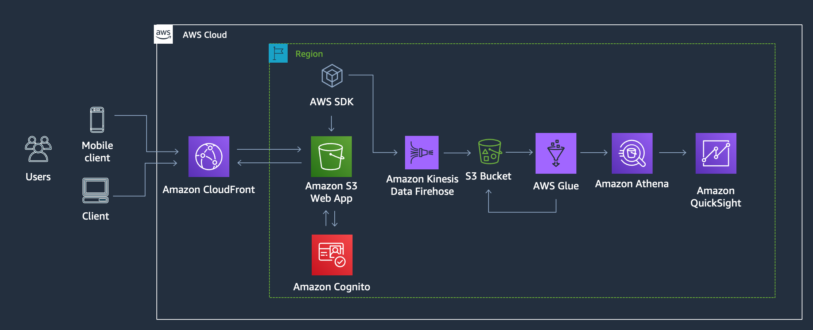
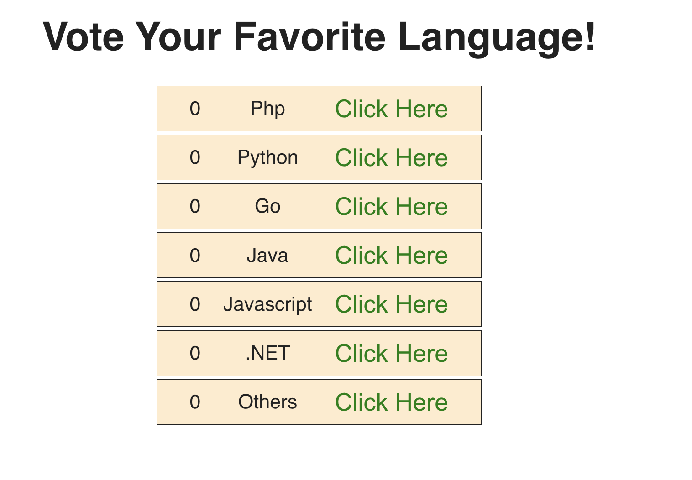
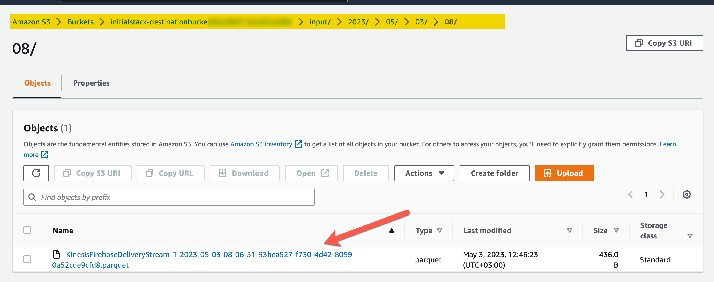
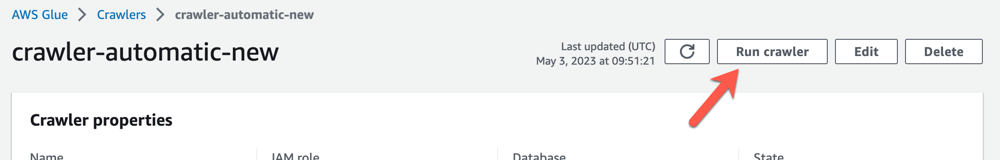
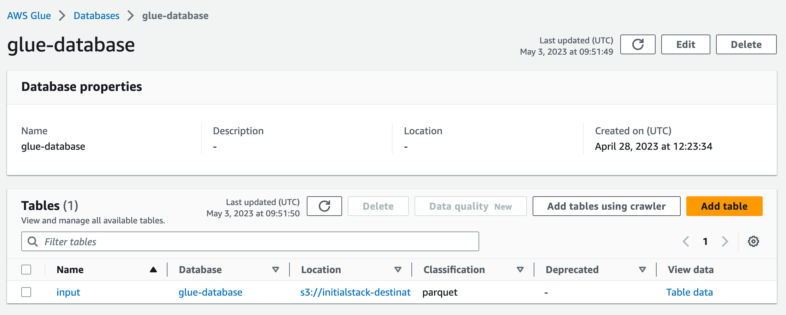
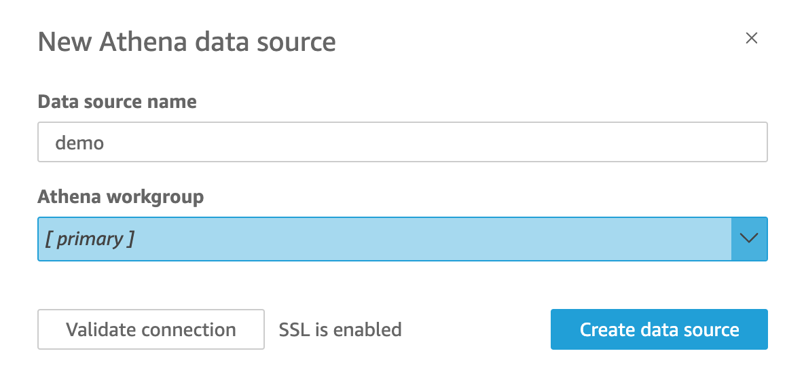
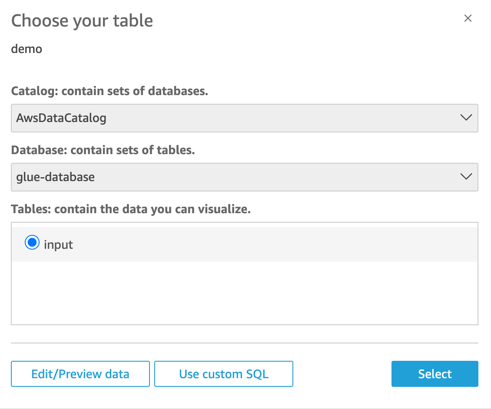
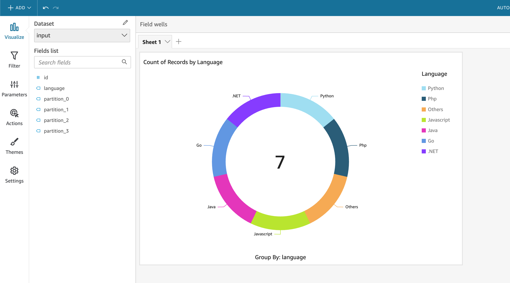

# Kinesis Firehose --> QuickSight demo

_Infrastructure as code framework used_: AWS CDK
_AWS Services used_: AWS Amplify, Amazon Cognito, Amazon Kinesis Firehose, Amazon Glue, AWS S3, Amazon Athena, Quicksight

## Summary of the demo

In this demo you will see:

- How to host an AWS Amplify application that sends messages to an Amazon Kinesis Firehose.
- How to create a Kinesis Firehose
- How to create an Amazon Glue Crawler
- How to use Kinesis Firehose to transform data as it comes into the stream

This demo is part of a video posted in FooBar Serverless channel. You can check the video to see the whole demo.

Important: this application uses various AWS services and there are costs associated with these services after the Free Tier usage - please see the AWS Pricing page for details. You are responsible for any AWS costs incurred. No warranty is implied in this example.

The application you will end up after following this instructions is this:



## Requirements

- AWS CLI already configured with Administrator permission
- AWS CDK - v2
- NodeJS 16.x installed
- CDK bootstrapped in your account

## Deploy this demo

To deploy this demo you need to follow diferent steps.

### Deploy the client to the cloud

The first step is to get the web application for this demo deployed. This webapp is a simple React application that allows the users to vote their favorite programing language.

To get the client ready you need to clone [this](https://github.com/mavi888/voting-app-amplify) repository. You will need to remember the name of the repository for later.



### Deploy the inital stack

After you have the client ready you can move to the backend. The first stack you need to deploy is the inital stack.

Deploy the project to the cloud:

```
cdk synth InitialStack
cdk deploy InitialStack
```

This stack will deploy:

- Destination Bucket - This bucket is where all the events sent to Kinesis Firehose will be stored
- Glue Database - This database will be used for conecting to Athena
- Cloudwatch Loggroup and Logstream - This loggroup and logstream will be used if there is any issue with the Kinesis Firehose.
- Kinesis firehose role - A role that will be assigned to the Kinesis Firehose with permissions to the bucket, to the glue database, and to the cloudwatch resources

### Deploy the crawler stack

After you deploy the initial stack you can copy to the bucket the seed data for the crawler.

You can find the data in /test-data/input/2023/05/05/08/file. Copy that file and everything under the input directory into S3.



Then move on to deploy the Crawler stack.

Deploy the project to the cloud:

```
cdk synth CrawlerStack
cdk deploy CrawlerStack
```

The crawler stacks creates an Amazon Glue crawler that crawls the input bucket and runs every hour at minute 0.

After you deploy the crawler go to the console and run it manually for the first time so it creates the Glue table.



When the crawler finish running for the first time you can check that the Glue table was created



### Deploy the kinesis firehose stack

After the crawler and table are created now you can deleted the test data in the bucket.

You can proceed to deploy the Kinesis Firehose stack to the cloud now

```
cdk synth KinesisFirehoseStack
cdk deploy KinesisFirehoseStack
```

This stack creates many resources in the cloud:

- Kinesis Firehose delivery stream: This is the main component for this demo. It creates a kinesis firehose delivery stream that gets elements from a bucket and then automatically converts them from JSON to Parquet.
- Cognito user pool and identity pool: Creates a cognito user pool and identity pool that provides temporary credentials to unregistered users to be able to put data in the kinesis data stream
- Amplify application that will host the client application stored in github in the first step.

### Create the Quicksight view

Now that you have deployed all these stacks you can move on to the last bit of the demo that is to create the QuickSight view.

1. Create a new dataset in Quicksight
   In your Quicksight configuration. You can go to security and permissions and add permissions to Quicksight to access your bucket.

Now you can create a new dataset for quicksight. Select Athena as a datasource and then complete the form with the information in the images.




Make sure that you select Direct query your data when prompted

2. Create a new Visualization. It should promt automatically when you finished adding the dataset but if not you can create a new visualization and use that datasource.



You can export this visualization as a dashboard when you are done.

## Test

Open the amplify web app and send some data. After a few minutes you can refresh the quicksight dashboard and you should see the data reflected there.

## Remove this application from the cloud

To delete the app:

```
cdk destroy --all
```

And delete the datasource and visualization in quicksight.

## Links related to this code

- Video with more details: [Serverless analytics playlist](https://www.youtube.com/playlist?list=PLGyRwGktEFqf-jHfORF9_X51r4UcFHOEK)
